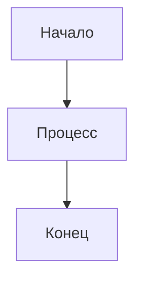

# 📚 Документация KKT PDF Service

Добро пожаловать в документацию сервиса KKT PDF! Здесь собраны все диаграммы, схемы и техническая документация проекта.

## 📋 Содержание документации

### 🗂️ **Быстрая навигация**
- **[DIAGRAMS_INDEX.md](./DIAGRAMS_INDEX.md)** - 📊 Индекс всех диаграмм и схем
- **[VIEWING_GUIDE.md](./VIEWING_GUIDE.md)** - 👀 Руководство по просмотру диаграмм
- **[EDITOR_DISABLE_GUIDE.md](./EDITOR_DISABLE_GUIDE.md)** - 🔧 Руководство по отключению редактора

### 🏗️ **Архитектурные диаграммы**
- **[system_architecture.md](./system_architecture.md)** - Общая системная архитектура
- **[architecture_diagram.md](./architecture_diagram.md)** - Детальные архитектурные диаграммы

### 📊 **UML диаграммы**
- **[UML_Diagram.md](./UML_Diagram.md)** - Основные UML диаграммы (классы, последовательности, состояния)

### 🔄 **Диаграммы активности**
- **[activity_diagrams.md](./activity_diagrams.md)** - Диаграммы активности для всех основных процессов

## 🎯 **Быстрый старт**

### Для просмотра диаграмм:
1. Установите расширение **"Mermaid Preview"** в VS Code
2. Откройте любой `.md` файл с диаграммами
3. Нажмите `Ctrl+Shift+P` → "Mermaid Preview"

### Онлайн просмотр:
- Перейдите на [mermaid.live](https://mermaid.live/)
- Скопируйте код диаграммы из файлов
- Вставьте в редактор

## 📁 **Структура проекта**

```
kkt-pdf_v2/
├── 📁 docs/                    # 📚 Документация
│   ├── README.md              # Этот файл
│   ├── system_architecture.md # Системная архитектура
│   ├── architecture_diagram.md# Архитектурные диаграммы
│   ├── UML_Diagram.md         # UML диаграммы
│   └── activity_diagrams.md   # Диаграммы активности
├── 📁 template/               # Шаблоны страниц
├── 📄 app.js                  # Основное приложение
├── 📄 editor.js               # Редактор позиций
├── 📄 pdf-export.js           # Экспорт PDF
├── 📄 index.html              # HTML интерфейс
├── 📄 styles.css              # CSS стили
└── 📄 server.py               # Python сервер
```

## 🔧 **Технические характеристики**

- **Архитектура**: Модульная (3 основных модуля)
- **Страницы**: 1-10 (динамическая загрузка)
- **Поля**: ИНН(12), КПП(9), ОГРН(15) символов
- **PDF**: Высокое качество (144 DPI)
- **Браузеры**: Современные с Canvas API

## 📖 **Описание модулей**

### **app.js** - Основное приложение
- Система логирования
- Навигация по страницам
- Рендеринг полей
- Валидация формы
- Координация модулей

### **editor.js** - Редактор позиций
- Перетаскивание полей
- Визуальная сетка
- История позиций
- Управление полями
- Генерация кода

### **pdf-export.js** - Экспорт PDF
- Создание PDF
- Генерация canvas
- Обработка изображений
- Скачивание файлов

## 🎨 **Типы диаграмм**

### **UML диаграммы:**
- Диаграмма классов
- Диаграмма последовательности
- Диаграмма состояний
- Диаграмма компонентов
- Диаграмма использования

### **Диаграммы активности:**
- Инициализация приложения
- Навигация по страницам
- Редактирование позиций
- Экспорт в PDF
- Валидация формы
- Обработка ошибок

### **Архитектурные диаграммы:**
- Общая схема системы
- Модульная архитектура
- Потоки данных
- Диаграмма развертывания

## 🚀 **Разработка**

### Добавление новых диаграмм:
1. Создайте новый `.md` файл в папке `docs/`
2. Используйте синтаксис Mermaid для диаграмм
3. Обновите этот README файл
4. Проверьте отображение в VS Code

### Формат диаграмм:
```markdown
## Название диаграммы


```

## 📞 **Поддержка**

Если у вас есть вопросы по документации или нужна помощь с диаграммами:
1. Проверьте раздел "Быстрый старт"
2. Убедитесь, что установлены нужные расширения VS Code
3. Используйте онлайн редактор Mermaid для тестирования

---

**Версия документации**: 1.0  
**Последнее обновление**: $(date)  
**Автор**: KKT PDF Service Team
