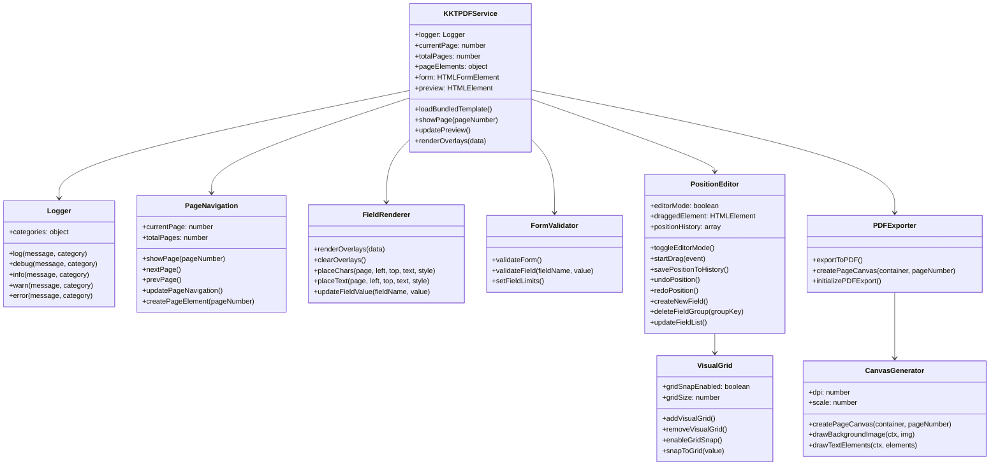
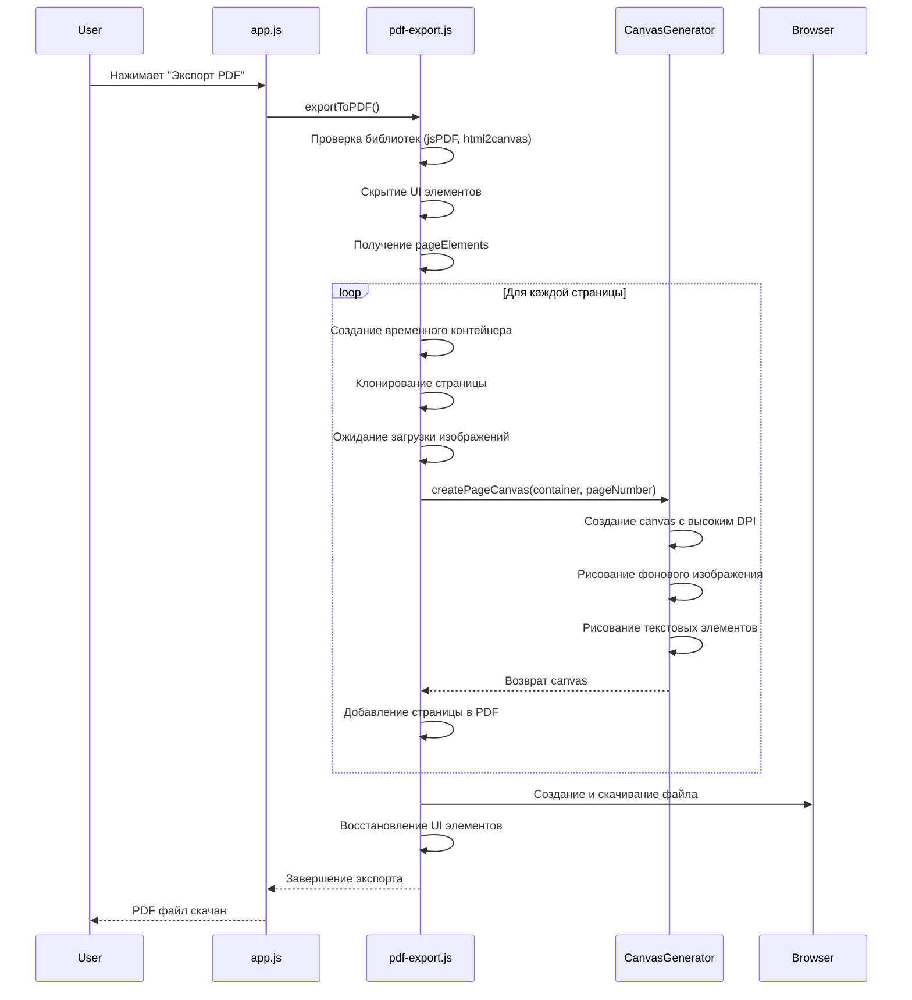
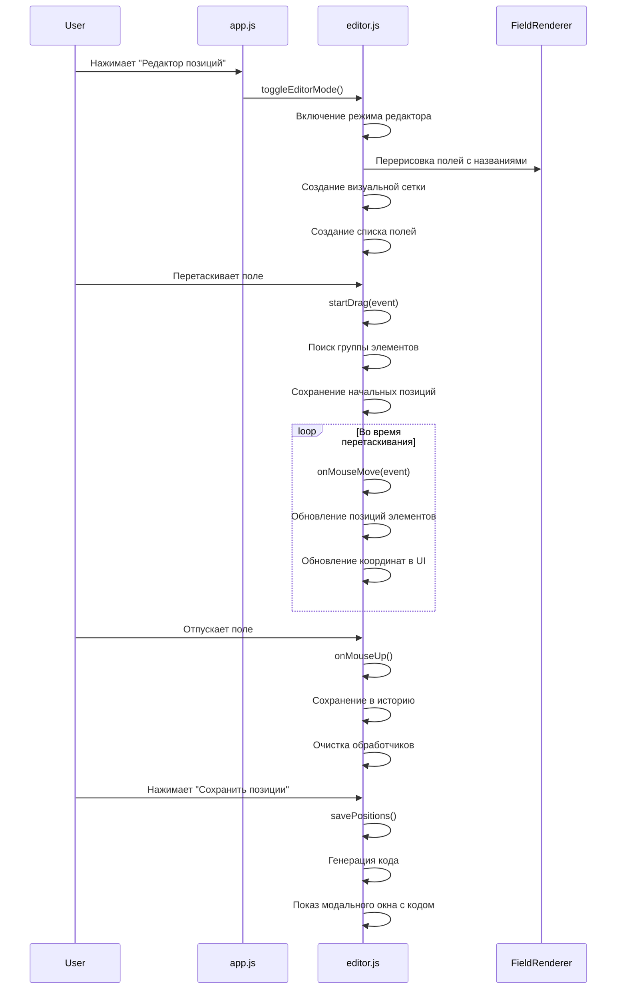
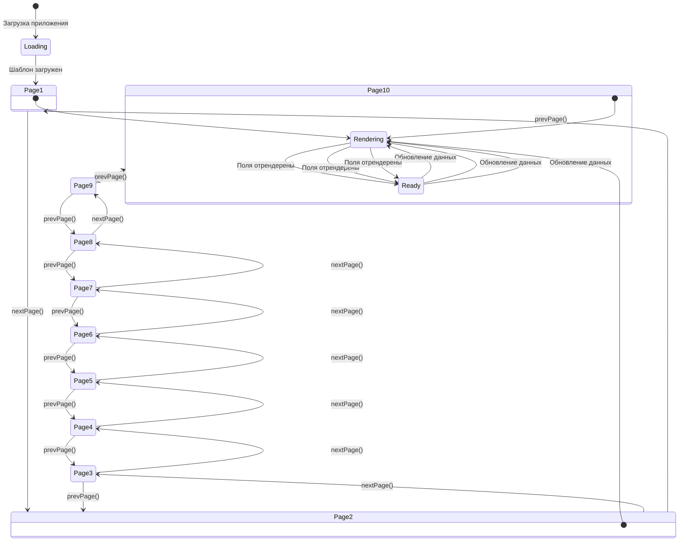
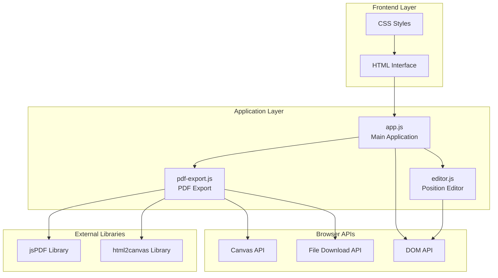

# UML Диаграмма сервиса KKT PDF

## Архитектура системы

```
┌─────────────────────────────────────────────────────────────────┐
│                        KKT PDF Service                         │
├─────────────────────────────────────────────────────────────────┤
│  HTML Interface (index.html)                                   │
│  ┌─────────────────┐ ┌─────────────────┐ ┌─────────────────┐   │
│  │   Form Fields   │ │  Page Navigation│ │  PDF Export     │   │
│  │   - ИНН/КПП     │ │  - Prev/Next    │ │  - Export Btn   │   │
│  │   - ОГРН        │ │  - Page Info    │ │                 │   │
│  │   - Organization│ │                 │ │                 │   │
│  └─────────────────┘ └─────────────────┘ └─────────────────┘   │
└─────────────────────────────────────────────────────────────────┘
                                │
                                ▼
┌─────────────────────────────────────────────────────────────────┐
│                    JavaScript Modules                          │
├─────────────────────────────────────────────────────────────────┤
│  app.js (Main Application)                                     │
│  ├── Logger System                                             │
│  ├── Page Navigation                                           │
│  ├── Field Rendering                                           │
│  ├── Form Validation                                           │
│  └── Module Initialization                                     │
│                                │                               │
│  editor.js (Position Editor)   │                               │
│  ├── Field Management          │                               │
│  ├── Drag & Drop              │                               │
│  ├── Visual Grid              │                               │
│  ├── Position History         │                               │
│  └── Code Generation          │                               │
│                                │                               │
│  pdf-export.js (PDF Export)    │                               │
│  ├── PDF Creation             │                               │
│  ├── Canvas Generation        │                               │
│  └── File Download            │                               │
└─────────────────────────────────────────────────────────────────┘
```

## Диаграмма классов



## Диаграмма последовательности - Экспорт PDF



## Диаграмма последовательности - Редактирование позиций



## Диаграмма состояний - Навигация по страницам



## Диаграмма компонентов



## Основные функции по модулям

### app.js (Основное приложение)
- `initializeLogger()` - инициализация системы логирования
- `loadBundledTemplate()` - загрузка шаблона страниц
- `showPage(pageNumber)` - отображение конкретной страницы
- `updatePreview()` - обновление превью с данными формы
- `renderOverlays(data)` - рендеринг полей на страницах
- `updateInnField(value)` - обновление поля ИНН
- `updateKppField(value)` - обновление поля КПП
- `updateOgrnField(value)` - обновление поля ОГРН
- `validateForm()` - валидация формы

### editor.js (Редактор позиций)
- `toggleEditorMode()` - переключение режима редактора
- `initializeAdvancedEditor()` - инициализация продвинутого редактора
- `startDrag(event)` - начало перетаскивания элементов
- `savePositionToHistory()` - сохранение позиций в историю
- `undoPosition()` - отмена последнего действия
- `redoPosition()` - повтор последнего действия
- `createNewField()` - создание нового поля
- `deleteFieldGroup(groupKey)` - удаление группы полей
- `updateFieldList()` - обновление списка полей
- `addVisualGrid()` - добавление визуальной сетки
- `createPreciseControls()` - создание точных контролов

### pdf-export.js (Экспорт PDF)
- `exportToPDF()` - основная функция экспорта в PDF
- `createPageCanvas(container, pageNumber)` - создание canvas для страницы
- `initializePDFExport()` - инициализация модуля экспорта

## Потоки данных

1. **Инициализация**: HTML → app.js → editor.js + pdf-export.js
2. **Навигация**: User → app.js → showPage() → renderOverlays()
3. **Редактирование**: User → editor.js → startDrag() → savePositionToHistory()
4. **Экспорт**: User → pdf-export.js → createPageCanvas() → Browser Download
5. **Валидация**: Form Input → app.js → validateForm() → updatePreview()
