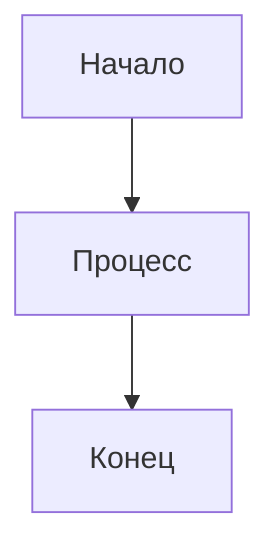

# 👀 Руководство по просмотру диаграмм

## 🚀 Быстрый старт

### 1. Установка расширений VS Code
```bash
# Установите эти расширения:
- Mermaid Preview (vstirbu.vscode-mermaid-preview)
- Markdown Preview Mermaid Support (bierner.markdown-mermaid)
```

### 2. Просмотр диаграмм в VS Code
1. Откройте любой `.md` файл в папке `docs/`
2. Нажмите `Ctrl+Shift+P` (или `Cmd+Shift+P` на Mac)
3. Введите "Mermaid Preview"
4. Выберите "Mermaid Preview"
5. Диаграмма откроется в отдельной панели

### 3. Онлайн просмотр
1. Перейдите на [mermaid.live](https://mermaid.live/)
2. Откройте любой `.md` файл из папки `docs/`
3. Скопируйте код диаграммы (между ```mermaid и ```)
4. Вставьте в онлайн редактор
5. Диаграмма отобразится автоматически

## 📁 Структура файлов

```
docs/
├── README.md              # Главная страница документации
├── DIAGRAMS_INDEX.md      # Индекс всех диаграмм
├── VIEWING_GUIDE.md       # Это руководство
├── system_architecture.md # Системная архитектура
├── architecture_diagram.md# Архитектурные диаграммы
├── UML_Diagram.md         # UML диаграммы
└── activity_diagrams.md   # Диаграммы активности
```

## 🎯 Типы диаграмм

### **UML диаграммы**
- **Классы** - структура объектов и их связи
- **Последовательности** - взаимодействие объектов во времени
- **Состояния** - изменение состояний системы
- **Компоненты** - физические компоненты
- **Использования** - сценарии использования

### **Диаграммы активности**
- **Процессы** - пошаговые алгоритмы
- **Потоки данных** - как данные передаются
- **Решения** - условная логика
- **Параллельность** - одновременные процессы

### **Архитектурные диаграммы**
- **Системная архитектура** - общая схема
- **Модульная архитектура** - взаимодействие модулей
- **Развертывания** - как система развертывается

## 🔧 Решение проблем

### Диаграмма не отображается в VS Code
1. Убедитесь, что установлено расширение "Mermaid Preview"
2. Проверьте синтаксис Mermaid (должен быть между ```mermaid и ```)
3. Перезапустите VS Code
4. Попробуйте онлайн редактор

### Ошибки в синтаксисе Mermaid
1. Проверьте правильность скобок и кавычек
2. Убедитесь, что все узлы определены
3. Проверьте правильность стрелок (--> или ---)
4. Используйте онлайн редактор для проверки

### Диаграмма слишком большая
1. Используйте масштабирование в VS Code
2. Экспортируйте в PNG/SVG через Mermaid Preview
3. Разделите диаграмму на несколько частей

## 📊 Экспорт диаграмм

### В VS Code (Mermaid Preview)
1. Откройте диаграмму в Mermaid Preview
2. Нажмите кнопку экспорта
3. Выберите формат (PNG, SVG, PDF)
4. Сохраните файл

### Онлайн (mermaid.live)
1. Откройте диаграмму в онлайн редакторе
2. Нажмите "Actions" → "Download"
3. Выберите формат
4. Скачайте файл

## 🎨 Настройка отображения

### Темы
- **Светлая тема** - по умолчанию
- **Темная тема** - настройте в VS Code
- **Кастомная тема** - через CSS в Mermaid

### Размеры
- **Автоматический** - по умолчанию
- **Фиксированный** - через параметры Mermaid
- **Адаптивный** - через CSS

## 📝 Создание новых диаграмм

### Формат файла
```markdown
# Название диаграммы

Описание диаграммы...



Дополнительное описание...
```

### Правила именования
- Используйте описательные названия
- Группируйте связанные диаграммы
- Добавляйте описания и комментарии
- Обновляйте индекс диаграмм

## 🔍 Поиск диаграмм

### По типу
- **UML** → UML_Diagram.md
- **Активности** → activity_diagrams.md
- **Архитектура** → system_architecture.md

### По функции
- **Экспорт PDF** → activity_diagrams.md (раздел "Экспорт в PDF")
- **Навигация** → activity_diagrams.md (раздел "Навигация по страницам")
- **Редактор** → activity_diagrams.md (раздел "Редактирование позиций")

### По компоненту
- **app.js** → system_architecture.md
- **editor.js** → UML_Diagram.md (классы)
- **pdf-export.js** → activity_diagrams.md (экспорт)

---

**Нужна помощь?** Проверьте [DIAGRAMS_INDEX.md](./DIAGRAMS_INDEX.md) для полного списка диаграмм.
