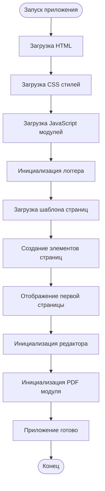
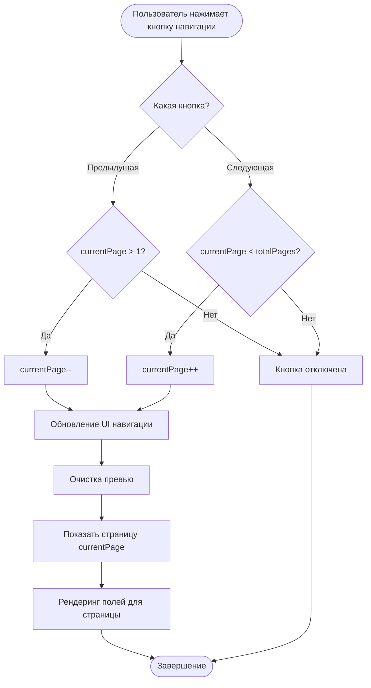
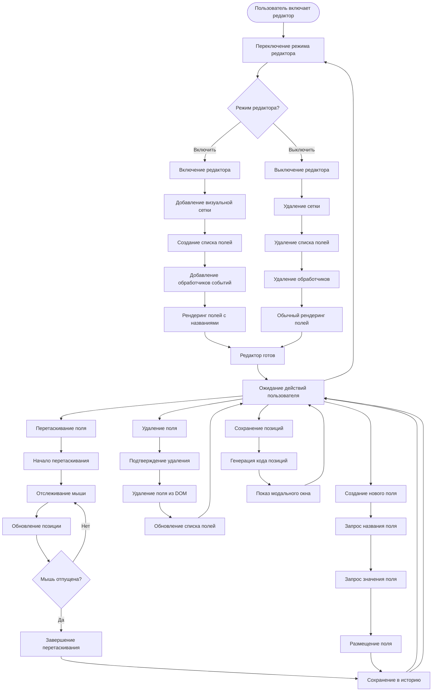
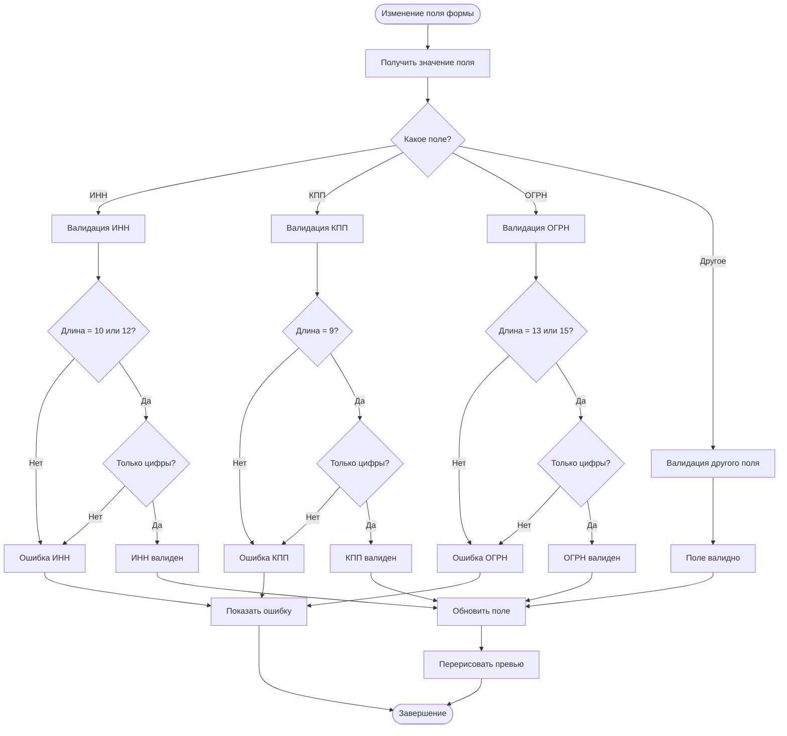
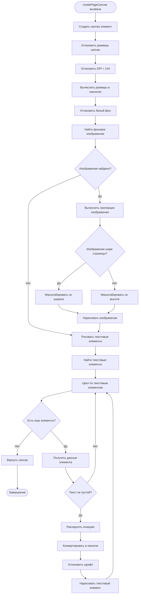
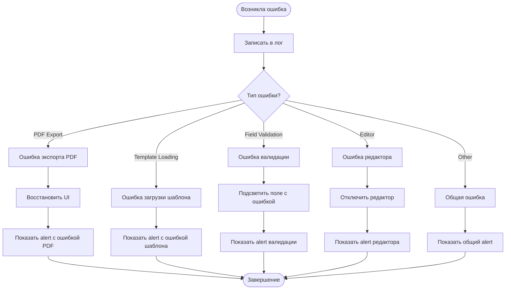

# Диаграммы активности KKT PDF Service

## Диаграмма активности - Инициализация приложения



## Диаграмма активности - Навигация по страницам



## Диаграмма активности - Редактирование позиций



## Диаграмма активности - Экспорт в PDF

```mermaid
flowchart TD
    Start([Пользователь нажимает "Экспорт PDF"]) --> CheckLibraries{Библиотеки загружены?}
    CheckLibraries -->|Нет| ShowError[Показать ошибку]
    CheckLibraries -->|Да| HideUI[Скрыть UI элементы]
    
    HideUI --> GetPages[Получить все страницы]
    GetPages --> CheckPages{Страницы найдены?}
    CheckPages -->|Нет| ShowError
    CheckPages -->|Да| CreatePDF[Создать PDF документ]
    
    CreatePDF --> LoopStart[Начать цикл по страницам]
    LoopStart --> CheckPage{Есть еще страницы?}
    CheckPage -->|Нет| FinalizePDF[Завершить PDF]
    CheckPage -->|Да| CreateContainer[Создать временный контейнер]
    
    CreateContainer --> ClonePage[Клонировать страницу]
    ClonePage --> WaitImages[Ожидать загрузки изображений]
    WaitImages --> CreateCanvas[Создать canvas для страницы]
    CreateCanvas --> DrawBackground[Нарисовать фоновое изображение]
    DrawBackground --> DrawText[Нарисовать текстовые элементы]
    DrawText --> AddToPDF[Добавить страницу в PDF]
    AddToPDF --> NextPage[Следующая страница]
    NextPage --> CheckPage
    
    FinalizePDF --> CreateBlob[Создать blob файла]
    CreateBlob --> DownloadFile[Скачать файл]
    DownloadFile --> RestoreUI[Восстановить UI элементы]
    RestoreUI --> Success[Успешное завершение]
    
    ShowError --> RestoreUI
    Success --> End([Конец])
```

## Диаграмма активности - Валидация формы



## Диаграмма активности - Создание canvas для PDF



## Диаграмма активности - Обработка ошибок


