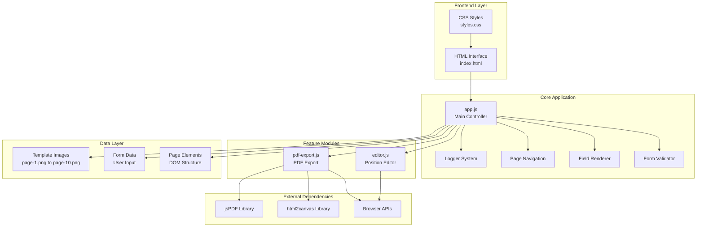
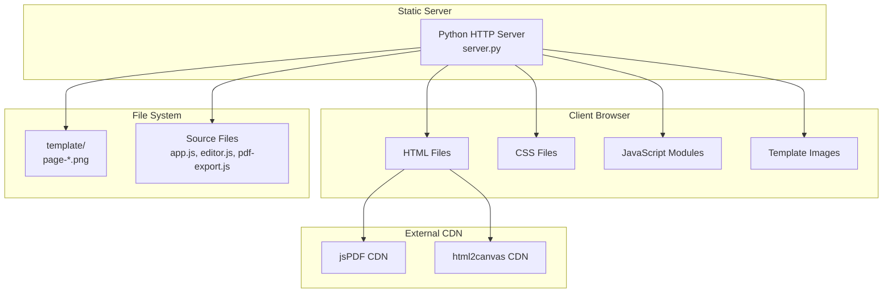

# Системная архитектура KKT PDF Service

## Общая схема системы

```
┌─────────────────────────────────────────────────────────────────┐
│                    KKT PDF Service                             │
│                    (Frontend Application)                      │
├─────────────────────────────────────────────────────────────────┤
│  Presentation Layer                                            │
│  ┌─────────────────┐ ┌─────────────────┐ ┌─────────────────┐   │
│  │   HTML Forms    │ │  Page Navigation│ │  PDF Export UI  │   │
│  │   - ИНН/КПП     │ │  - Prev/Next    │ │  - Export Btn   │   │
│  │   - ОГРН        │ │  - Page Info    │ │  - Progress     │   │
│  │   - Organization│ │  - Page Counter │ │                 │   │
│  └─────────────────┘ └─────────────────┘ └─────────────────┘   │
│  ┌─────────────────┐ ┌─────────────────┐ ┌─────────────────┐   │
│  │  Editor UI      │ │  Validation UI  │ │  Logging UI     │   │
│  │  - Toggle Btn   │ │  - Error Msgs   │ │  - Console Logs │   │
│  │  - Field List   │ │  - Field Hints  │ │  - Debug Info   │   │
│  │  - Controls     │ │  - Success Msgs │ │                 │   │
│  └─────────────────┘ └─────────────────┘ └─────────────────┘   │
└─────────────────────────────────────────────────────────────────┘
                                │
                                ▼
┌─────────────────────────────────────────────────────────────────┐
│                    Business Logic Layer                        │
├─────────────────────────────────────────────────────────────────┤
│  app.js (Main Application Controller)                          │
│  ├── Logger System                                             │
│  │   ├── Console Logging                                       │
│  │   ├── Category Filtering                                    │
│  │   └── Debug Information                                     │
│  ├── Page Management                                           │
│  │   ├── Page Navigation                                       │
│  │   ├── Page Rendering                                        │
│  │   └── Page State Management                                 │
│  ├── Field Management                                          │
│  │   ├── Field Rendering                                       │
│  │   ├── Field Validation                                      │
│  │   └── Field Updates                                         │
│  └── Module Coordination                                       │
│      ├── Editor Initialization                                 │
│      ├── PDF Export Initialization                             │
│      └── Event Handling                                        │
└─────────────────────────────────────────────────────────────────┘
                                │
                    ┌───────────┼───────────┐
                    │           │           │
                    ▼           ▼           ▼
┌─────────────────┐ ┌─────────────────┐ ┌─────────────────┐
│  editor.js      │ │  pdf-export.js  │ │  External APIs  │
│  (Position      │ │  (PDF Export    │ │  (Browser APIs) │
│   Editor)       │ │   Module)       │ │                 │
│  ├── Drag & Drop│ │  ├── PDF        │ │  ├── Canvas API │
│  ├── Visual Grid│ │  │   Generation │ │  ├── File API   │
│  ├── Position   │ │  ├── Canvas     │ │  ├── DOM API    │
│  │   History    │ │  │   Creation   │ │  └── Event API  │
│  ├── Field      │ │  ├── Image      │ │                 │
│  │   Management │ │  │   Processing │ │                 │
│  └── Code       │ │  └── File       │ │                 │
│      Generation │ │      Download   │ │                 │
└─────────────────┘ └─────────────────┘ └─────────────────┘
```

## Модульная архитектура



## Потоки данных

### 1. Инициализация приложения
```
HTML Load → CSS Load → JS Modules Load → Logger Init → Template Load → Page Creation → Editor Init → PDF Init → Ready
```

### 2. Навигация по страницам
```
User Click → Navigation Handler → Page Validation → UI Update → Preview Clear → Page Show → Field Render → Complete
```

### 3. Редактирование позиций
```
Editor Toggle → Mode Check → UI Update → Grid Add → Field List → Event Listeners → Drag Handling → Position Save → History Update
```

### 4. Экспорт в PDF
```
Export Click → Library Check → UI Hide → Page Loop → Canvas Create → Image Draw → Text Draw → PDF Add → File Download → UI Restore
```

### 5. Валидация формы
```
Field Change → Value Get → Field Type Check → Validation Rules → Error Check → UI Update → Preview Render
```

## Основные компоненты и их функции

### app.js (Основное приложение)
- **Logger System**: Централизованное логирование с категориями
- **Page Navigation**: Управление отображением страниц (1-10)
- **Field Rendering**: Рендеринг полей на страницах с позиционированием
- **Form Validation**: Валидация полей ИНН/КПП/ОГРН с ограничениями
- **Module Coordination**: Инициализация и координация всех модулей

### editor.js (Редактор позиций)
- **Drag & Drop**: Перетаскивание полей с привязкой к сетке
- **Visual Grid**: Визуальная сетка для точного позиционирования
- **Position History**: История изменений с возможностью отмены/повтора
- **Field Management**: Создание, удаление, группировка полей
- **Code Generation**: Генерация кода позиций для обновления

### pdf-export.js (Экспорт PDF)
- **PDF Creation**: Создание PDF документа с помощью jsPDF
- **Canvas Generation**: Создание высококачественных canvas для каждой страницы
- **Image Processing**: Обработка фоновых изображений страниц
- **Text Rendering**: Рендеринг текстовых элементов на canvas
- **File Download**: Скачивание готового PDF файла

## Технические характеристики

### Производительность
- **Canvas DPI**: 144 (высокое качество для PDF)
- **Максимум страниц**: 10 (стандарт для заявления ККТ)
- **Ограничения полей**: ИНН (12), КПП (9), ОГРН (15 символов)
- **Поддержка браузеров**: Современные браузеры с Canvas API

### Безопасность
- **Валидация входных данных**: Строгая проверка форматов полей
- **Санитизация HTML**: Безопасное создание DOM элементов
- **Ограничения файлов**: Контроль размера и типа экспортируемых файлов

### Масштабируемость
- **Модульная архитектура**: Легкое добавление новых функций
- **Разделение ответственности**: Независимые модули
- **Конфигурируемость**: Настройки через константы и флаги

## Диаграмма развертывания



## Заключение

KKT PDF Service представляет собой современное веб-приложение с модульной архитектурой, обеспечивающее:

1. **Удобный интерфейс** для заполнения заявления ККТ
2. **Точное позиционирование** полей с помощью визуального редактора
3. **Высококачественный экспорт** в PDF формат
4. **Надежную валидацию** данных формы
5. **Модульную архитектуру** для легкого расширения и поддержки

Система спроектирована с учетом принципов SOLID и обеспечивает высокую производительность, безопасность и масштабируемость.
